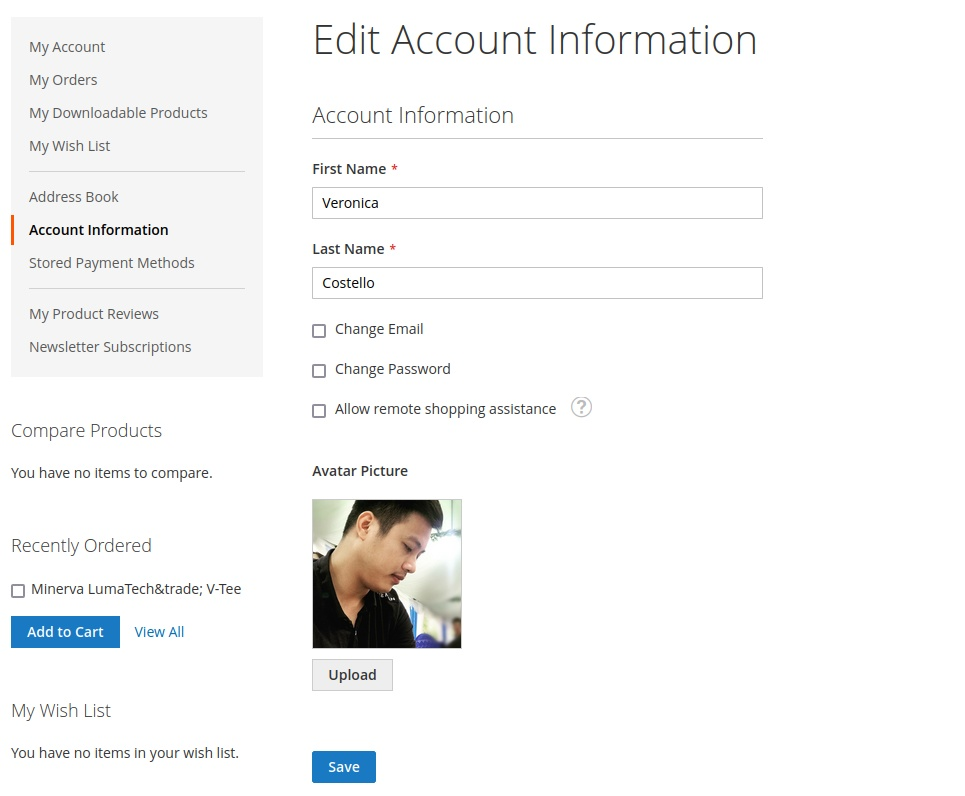

# Magento 2 Module Customer Avatar

    composer require ghoster/module-customeravatar

---
## Overview
Add a customer avatar as a customer attribute on customer edit, header.

- [Extension on GitHub](https://github.com/tuyennn/magento2-customer-avatar)
- [Direct download link](https://github.com/tuyennn/magento2-customer-avatar/tarball/master)

## Main Functionalities
- Add a customer avatar as a customer attribute on customer edit, header.
- Able to upload as a simple attribute admin-end.
- Private content for loading avatar on header.
- Modern uploader from customer edit page.

## Installation
\* = in production please use the `--keep-generated` option

### Type 1: Zip file

 - Unzip the zip file in `app/code/GhoSter`
 - Enable the module by running `php bin/magento module:enable GhoSter_CustomerAvatar`
 - Apply database updates by running `php bin/magento setup:upgrade`\*
 - Flush the cache by running `php bin/magento cache:flush`

### Type 2: Composer

 - Make the module available in a composer repository for example:
    - private repository `repo.magento.com`
    - public repository `packagist.org`
    - public github repository as vcs
 - Add the composer repository to the configuration by running `composer config repositories.repo.magento.com composer https://repo.magento.com/`
 - Install the module composer by running `composer require ghoster/module-customeravatar`
 - enable the module by running `php bin/magento module:enable GhoSter_CustomerAvatar`
 - apply database updates by running `php bin/magento setup:upgrade`\*
 - Flush the cache by running `php bin/magento cache:flush`

## Configuration

- Enable Header: Enable avatar on header

## Specifications

- `avatar` as customer attribute

## Attributes

 - Customer - Avatar (avatar)

